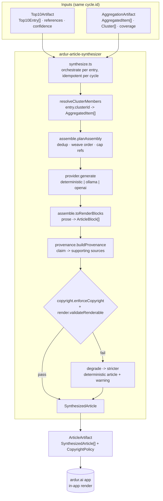
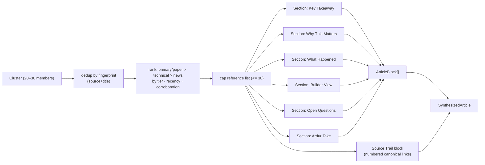
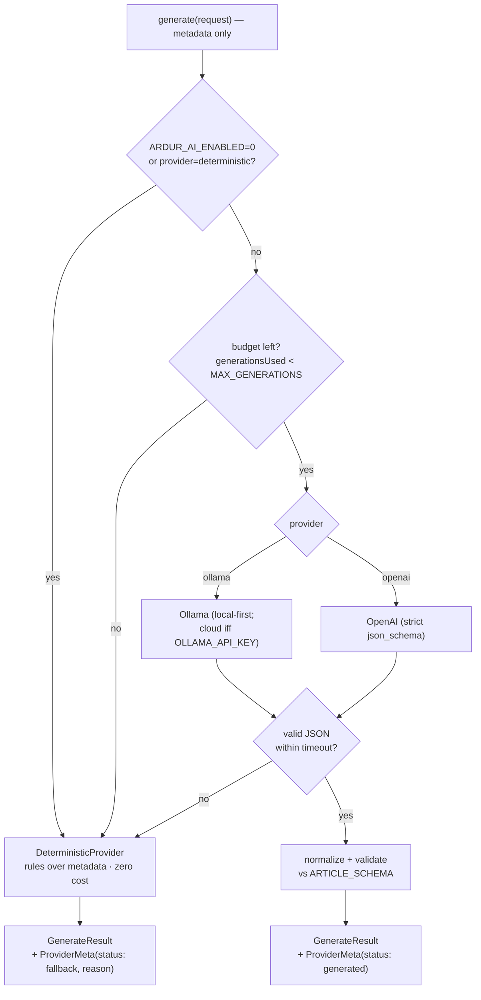

# ardur-article-synthesizer — Design Specification

> **Stage 4** of the Ardur AI content pipeline. Schema: `ardur-content-pipeline/v1`.
> This document is the authoritative design for the synthesizer. The
> pipeline-wide contract lives in [`../ARCHITECTURE.md`](../ARCHITECTURE.md); the
> wire types live in [`../src/contracts.ts`](../src/contracts.ts) (vendored,
> byte-identical across all four repos).
>
> **Status: design + scaffold.** Synthesis logic is intentionally not
> implemented. Every `src/` module ships final signatures and stub bodies.

## Table of contents

1. [Purpose & scope](#1-purpose--scope)
2. [Architecture overview](#2-architecture-overview)
3. [Data-flow diagrams](#3-data-flow-diagrams)
4. [Inputs, outputs & schemas](#4-inputs-outputs--schemas)
5. [Article assembly rules](#5-article-assembly-rules)
6. [In-app render contract](#6-in-app-render-contract)
7. [Copyright-safe synthesis](#7-copyright-safe-synthesis)
8. [Cost-guarded, pluggable AI provider](#8-cost-guarded-pluggable-ai-provider)
9. [Provenance & data provenance](#9-provenance--data-provenance)
10. [Migration from ardur.ai (Hermes)](#10-migration-from-ardurai-hermes)
11. [Error handling, monitoring & fallback](#11-error-handling-monitoring--fallback)
12. [Performance, scalability & latency](#12-performance-scalability--latency)
13. [Security & privacy](#13-security--privacy)
14. [Open questions](#14-open-questions)

---

## 1. Purpose & scope

The synthesizer answers one question per Top-10 topic: **"Given the 20–30 sources
that cover this topic right now, what is the one original article an Ardur reader
should read — inside the app, without leaving the page?"**

In scope:

- Consume the `Top10Artifact` (what to write about) + `AggregationArtifact` (the
  sources to weave) for a single 6-hour cycle.
- Produce an `ArticleArtifact`: exactly one `SynthesizedArticle` per `Top10Entry`.
- Enforce copyright safety, per-claim provenance, privacy, and in-app
  renderability on every article.

Out of scope (owned by other engines): source ingestion, scoring, Top-10
selection, refresh orchestration. The synthesizer is a **pure function of its two
input artifacts** plus the provider's (non-deterministic) prose — and even that is
pinned to a deterministic fallback so CI is fully reproducible.

## 2. Architecture overview



**Design principles**

- **Fail closed, never abort.** A single article that cannot be made safe is
  dropped or degraded; the cycle still produces an artifact for every other entry.
- **Deterministic by default.** The zero-cost rules path is a *complete* article
  generator, not a placeholder. AI only improves prose quality.
- **Metadata in, original out.** The engine sees titles, sources, links, and
  dates — never article bodies. It cannot reproduce what it never reads.
- **Provenance is a precondition, not a footnote.** A claim with no supporting
  source does not reach the body.

## 3. Data-flow diagrams

### 3.1 The 6-hour cycle (synthesizer's slice)

```mermaid
sequenceDiagram
  autonumber
  participant Top as top10-engine (orchestrator)
  participant Syn as article-synthesizer
  participant Prov as AI provider
  participant App as ardur.ai

  Top->>Syn: runSynthesis(Top10Artifact, AggregationArtifact)
  loop per Top10Entry (rank 1..N)
    Syn->>Syn: resolveClusterMembers(entry, aggregation)
    Syn->>Syn: planAssembly(entry, members)
    alt provider.canGenerate() (budget left, enabled)
      Syn->>Prov: generate(metadata-only request)
      Prov-->>Syn: ArticleDraft (or fallback on error/timeout)
    else budget spent / disabled
      Syn->>Syn: deterministic draft (rules over metadata)
    end
    Syn->>Syn: buildProvenance + enforceCopyright + validateRenderable
  end
  Syn-->>Top: ArticleArtifact (upstream = top10 runId)
  Top->>App: publish artifacts for cycle C
  Note over App: app renders SynthesizedArticle in place; no page hop
```

### 3.2 One article's source weave



## 4. Inputs, outputs & schemas

All artifacts are wrapped in `ArtifactEnvelope<T>` (see `contracts.ts`), carrying
`schemaVersion`, `runId`/`upstreamRunId`, `cycle`, `topics`, optional `provider`,
and `warnings`.

### 4.1 Contract-name reconciliation

The pipeline brief names abstract types (`NewsItem`, `TopicCluster`,
`SourceRef`, `Top10Entry`, `SynthesizedArticle`). The **authoritative** wire types
in `contracts.ts` (authored by the aggregator session) realize them as:

| Brief / abstract | Authoritative wire type | Notes |
|------------------|-------------------------|-------|
| `NewsItem` | `AggregatedItem` | per-source item inside a cluster |
| `TopicCluster` | `Cluster` | grouped members + tier histogram |
| `SourceRef` | `SourceRef` | same name; link + attribution, never body |
| `Top10Entry` | `Top10Entry` | same name; rank + references + confidence |
| `SynthesizedArticle` | `SynthesizedArticle` | same name; `body: ArticleBlock[]` |

This repo treats `contracts.ts` as the single source of truth and maps the
abstract names onto it. Any change to the wire types is an **additive, lockstep**
change across all four repos (see §9.2).

### 4.2 Input — what the synthesizer reads

- **`Top10Artifact` (`ArticleData` upstream)** — `Top10Entry[]` per topic and a
  `global` list. Each entry supplies `rank`, `clusterId`, `topic/topicLabel`,
  `headline`, `score`, `sourceQuality`, `confidence`, and a capped, deduped
  `references: SourceRef[]`. **This decides which articles exist and their rank.**
- **`AggregationArtifact`** — `clustersByTopic` + `itemsByTopic`. The
  synthesizer resolves `entry.clusterId` → the cluster's `memberIds` →
  `AggregatedItem[]` (the 20–30 sources, with `tier`, `publishedAt`,
  `summaryHint`, `url`, `sourceDomain`). **This supplies the material to weave.**

> The two inputs **must share `cycle.id`**. A mismatch is recorded as a warning
> and the synthesizer proceeds with the Top-10 references alone (degraded weave).

### 4.3 Output — `SynthesizedArticle` (the deliverable)

Each entry yields one article (fields from `contracts.ts`):

```ts
interface SynthesizedArticle {
  id; rank; topic; topicLabel;
  headline;            // ORIGINAL
  dek;                 // ORIGINAL standfirst
  body: ArticleBlock[];// ORIGINAL prose, in-app render model
  keyPoints: string[];
  whyItMatters; readerAction; tags: string[];
  confidence; sourceQuality;
  references: ArticleReference[]; // canonical link per source synthesized
  provenance: { clusterId; sourceCount; distinctDomains; upstreamRunId };
  ai: ProviderMeta;    // provider/model/status/reason
  legalNote;           // copyright posture
  wordCount; readingTimeMinutes; generatedAt;
}
```

The artifact also carries the `CopyrightPolicy` it was generated under
(`maxQuoteWords: 25`, `originalTextOnly: true`, `reproduceArticleBody: false`).

### 4.4 Metadata captured on every article

`ai` (provider provenance) · `provenance` (source coverage) · `confidence` +
`sourceQuality` (derived from distinct-source count, mirroring Hermes:
≥3 sources → high, 2 → medium, 1 → low) · `wordCount`/`readingTimeMinutes` ·
`generatedAt` (cycle-stamped, UTC).

## 5. Article assembly rules

Implemented in [`src/assemble.ts`](../src/assemble.ts). The rules are how
**20–30 sources become one original piece** rather than a link dump.

### 5.1 Weave & reference selection

1. **Dedup** cluster members by fingerprint (normalized source + title).
2. **Rank for weave**: `primary`/`paper` tiers first, then `technical-news`,
   then `news`/`security-news`; within a tier, more recent and more corroborated
   first. The most authoritative source anchors *What Happened*.
3. **Cap** the reference list at `MAX_REFERENCES` (30). Every retained source
   appears in the Source Trail with a canonical link — nothing is woven without
   being citable.

### 5.2 Section plan (fixed render order)

The section order mirrors ardur.ai's content-engine contract so the in-app
article matches the existing site:

| # | Section | Required | Target words | Purpose |
|---|---------|----------|--------------|---------|
| 1 | **Key Takeaway** | yes | ~60 | What changed, in one paragraph |
| 2 | **Why This Matters** | yes | ~110 | Reader impact, no deep prior context assumed |
| 3 | **What Happened** | yes | ~140 | Original summary of the event/release |
| 4 | **Builder View** | no | ~120 | Practitioner implications |
| 5 | **Open Questions** | no | ~80 | What remains unverified |
| 6 | **Ardur Take** | yes | ~90 | Practical judgment + confidence |

Minimum publishable body is `MIN_BODY_WORDS` (150). An article that cannot reach
the floor from available metadata is emitted with `confidence: low` and a warning.

### 5.3 Weaving discipline

- One section may carry **at most one** short attributed quote (< 25 words) and
  only when a primary source's exact wording is editorially necessary.
- Corroborated facts (≥2 distinct sources) are stated plainly; single-source
  facts are hedged ("according to …", reflected in `confidence`).
- The synthesizer writes *about* the sources; it never stitches their sentences.

## 6. In-app render contract

Defined in [`src/render.ts`](../src/render.ts). The article is read **inside
ardur.ai** — there is no HTML page hop and no Markdown round-trip at read time.
`body: ArticleBlock[]` **is** the render model.

`ArticleBlock` types: `paragraph` · `heading` · `list` · `quote` (carries
`attribution { source, url }`) · `callout`.

**Render order the app guarantees:**

1. `headline` (original) → 2. `dek` (original standfirst) →
3. meta strip (`confidence` · `sourceQuality` · `readingTimeMinutes` ·
`generatedAt`) → 4. `keyPoints` (scannable) → 5. `body` blocks (section order) →
6. *Why it matters* + *Reader action* callouts → 7. **Source Trail block** →
8. legal/citation posture line.

### 6.1 Source-trail / citation block

Modeled on `ArticleSourceTrail.astro` already in ardur.ai: a numbered list of
canonical links **kept separate from the prose** so readers can audit the trail
without cluttering the body. Each entry shows source type, "checked" date, the
canonical link, and the specific claim it supports. The block also renders the
provider provenance (`ai.provider/model/generatedAt`) and the legal posture line.

`RENDER_CONTRACT` (data object) lets the app and the synthesizer assert against
the same guarantees: `inApp: true`, `bodyModel: 'ArticleBlock[]'`,
`sourceTrailSeparate: true`, `quotesAttributed: true`, `maxBlocks: 120`.
`validateRenderable()` rejects unknown block types, unattributed quotes, raw HTML
smuggled into `text`, empty blocks, and a missing source trail.

## 7. Copyright-safe synthesis

The **non-negotiable gate**, in [`src/copyright.ts`](../src/copyright.ts). An
article that fails any check is rejected; the cycle degrades that entry to a
stricter deterministic article and records a warning. **Failing closed (drop) is
preferred to publishing unsafe text.**

| Rule | Enforcement |
|------|-------------|
| Original text only | The engine never receives article bodies; output is generated, then overlap-checked. |
| Quotes < 25 words | `isQuoteWithinLimit`, `MAX_QUOTE_WORDS = 25`; every quote block must carry `attribution`. |
| Attribution + canonical link per source | every synthesized source appears in `references` with a canonical URL. |
| No reproduced body / phrasing | `longestVerbatimRun` vs the cluster's titles/`summaryHint`; > `MAX_VERBATIM_NGRAM` (8 words) overlap is a violation. |
| No credential/secret leak | regex screen ported from `validate-articles.mjs` over body + metadata. |

`legalNote` on every article records the posture: *"Original Ardur synthesis from
headline/feed metadata; references preserved; no article body copied."*

## 8. Cost-guarded, pluggable AI provider

In [`src/provider.ts`](../src/provider.ts), extracted and generalized from
ardur.ai's `src/lib/aiProvider.mjs` (`generateSignalBrief`).



- **Order**: `deterministic` (default, zero-cost) → `ollama` (local
  `127.0.0.1:11434`, cloud only if `OLLAMA_API_KEY` set) → `openai` (optional).
- **Budget**: `ARDUR_AI_MAX_GENERATIONS` (default 20) caps model calls *per run*;
  once spent, every remaining article is deterministic. Matches ardur.ai's
  `budget=0` posture: with no key/Ollama, the engine runs 100% deterministic — the
  current production reality.
- **Timeout**: `ARDUR_AI_TIMEOUT_MS` (default 20000) wraps every call; on
  timeout/HTTP error/non-JSON the article falls back to deterministic and records
  `ProviderMeta.reason`.
- **CI**: always `ARDUR_AI_PROVIDER=deterministic` — no network model calls, fully
  reproducible.
- The provider sees **metadata only** (titles, sources, dates, links) and is
  instructed to write original prose, never copy wording, and flag uncertainty for
  single-source topics.

## 9. Provenance & data provenance

In [`src/provenance.ts`](../src/provenance.ts). **Every generated claim is
traceable to the sources that support it.**

### 9.1 Two levels

1. **Article-level** (`SynthesizedArticle.provenance`, on the wire today):
   `clusterId`, `sourceCount`, `distinctDomains`, `upstreamRunId` — traces the
   article back through the cycle to the exact aggregation run.
2. **Claim-level** (internal `ProvenanceMap`): each atomic claim is aligned to the
   `supportingSourceIds` that back it, with a `strength`
   (`corroborated` | `single-source` | `inferred`) and an `isEditorial` flag.
   `isFullyGrounded()` requires **every factual (non-editorial) claim to have ≥1
   supporting source** before the article is allowed out. Quote blocks surface
   their source via `attribution`.

### 9.2 Surfacing claim-level provenance on the wire

A richer `claims?: ClaimProvenance[]` on `SynthesizedArticle` is a **proposed
additive field**. Per the contract-evolution rules in `ARCHITECTURE.md §5`,
additive fields need **no schema-version bump** but **must be ratified in lockstep
across all four repos** before `contracts.ts` changes. Until ratified, the type
lives only in this repo and claim-level provenance is surfaced via quote
attribution + the article-level roll-up. (Tracked as a starter issue.)

## 10. Migration from ardur.ai (Hermes)

The synthesizer extracts and generalizes working code on `ardur.ai/main`:

| Existing (`ardur.ai/main`) | Extract into | Promotion |
|----------------------------|--------------|-----------|
| `src/lib/aiProvider.mjs` (`generateSignalBrief`, `SIGNAL_BRIEF_SCHEMA`, provider chain, budget, timeout, deterministic fallback) | `src/provider.ts` | brief schema → `ARTICLE_SCHEMA` (sectioned) |
| `scripts/build-news-digests.mjs` (`digestFromCluster`, `sourceQuality`, `confidenceFromReferences`, `safeReference`, `legalNote`) | `src/assemble.ts` + `src/copyright.ts` | single-paragraph digest → full sectioned article |
| `scripts/refresh-article-intelligence.mjs` (aggregate-only metrics policy, forbidden-key screen, AI budget counter) | `src/privacy.ts` | reuse `FORBIDDEN_METRIC_KEY_FRAGMENTS` |
| `src/components/ArticleSourceTrail.astro` | `src/render.ts` (Source Trail contract) | render block ↔ `ArticleBlock[]` + references |
| `scripts/source-safety.mjs` | shared `source-safety` port (`scrubUrl`) | SSRF-safe URL normalization |
| `docs/content-engine-contract.md` (section order, frontmatter, run report) | `src/assemble.ts` `SECTION_PLAN` + run report | site contract → artifact contract |

Migration is **incremental**: the ardur.ai monolith keeps producing digests while
this engine is stood up behind the same JSON-snapshot contract the app consumes.

## 11. Error handling, monitoring & fallback

| Failure | Behavior |
|---------|----------|
| Provider timeout / HTTP error / non-JSON | Deterministic fallback for that article; `ProviderMeta.reason` set; warning added. |
| Generation budget exhausted | Remaining articles deterministic; one summary warning. |
| Cluster has < 2 sources | Article still produced, `confidence: low`, single-source facts hedged. |
| `cycle.id` mismatch between inputs | Warning; weave from Top-10 references only. |
| Copyright/render gate fails | Article degraded to stricter deterministic form; if still failing, **dropped** with a warning (never published unsafe). |
| Missing cluster for an entry | Entry skipped; warning names the `clusterId`. |

**Idempotency**: `synthesizeCycle` is idempotent per `cycle.id`; a failed cycle is
safely re-runnable. **Availability**: if the whole run fails, the app serves the
previous cycle's `ArticleArtifact` (last-good-wins; no blank states).

**Monitoring signals** (emitted to logs / run report, PII-scrubbed):
`articlesProduced`, `articlesDegraded`, `articlesDropped`, `generationsUsed` /
budget, `providerFallbackRate`, per-stage p95 latency, `unsupportedClaimCount`
(must be 0), copyright-violation counts by kind.

## 12. Performance, scalability & latency

Batch stage; SLOs from `ARCHITECTURE.md §8`:

| Metric | Target |
|--------|--------|
| Synthesis stage p95 (per cycle) | **≤ 12 min** |
| Full pipeline cycle | ≤ 25 min (≫ inside the 6h window) |
| Per-article deterministic latency | < 50 ms (pure compute) |
| Per-article model latency | ≤ `ARDUR_AI_TIMEOUT_MS` (default 20 s), then fallback |
| Model calls per cycle | ≤ `ARDUR_AI_MAX_GENERATIONS` (default 20) |
| Freshness | published article never older than one cycle + 25 min |

**Scalability**: articles are independent → synthesized concurrently with bounded
parallelism; the deterministic path has no external dependency and scales with
CPU. The reference cap (30) bounds per-article work regardless of cluster size.
With budget = 0 (today's reality), throughput is CPU-bound and effectively
unlimited within the window.

## 13. Security & privacy

- **No PII in URLs or logs** ([`src/privacy.ts`](../src/privacy.ts)): every
  reference URL is run through `scrubUrl` (drop credentials, fragment, and
  `STRIPPED_URL_PARAMS` tracking params). Log/run-report keys are screened with
  `isForbiddenKey` against the shared `FORBIDDEN_METRIC_KEY_FRAGMENTS`.
- **Aggregate-only metrics**: the synthesizer never ingests per-user data; it
  only reads aggregate interaction signals already present upstream.
- **Source safety**: outbound fetches (if any are added) reuse the shared
  SSRF-safe port (HTTPS-only, allow-listed hosts, blocked private IPs, bounded
  reads). The synthesizer itself is metadata-driven and ideally fetch-free.
- **Secrets**: provider keys come from env / OS keychain / CI secrets — never
  written into artifacts, run reports, logs, or commits. A credential regex screen
  is part of the copyright gate.
- **Determinism & audit**: with the deterministic provider, output is fully
  reproducible from the two input artifacts; `ai` records provider/model/status
  for every article.

## 14. Open questions

- **Claim-level provenance on the wire** — ratify `claims?: ClaimProvenance[]`
  across all four repos, or keep it internal? (additive; needs lockstep)
- **Per-article vs per-section model calls** — one call for the whole article, or
  one per section for tighter grounding within the budget?
- **Multilingual topics** — `NewsItem`/`AggregatedItem` carries `language`/`region`
  upstream; does the synthesizer emit per-language articles or one canonical
  English piece with localized decks?
- **Quote selection** — heuristic vs model-chosen, and how to guarantee the < 25
  word + attribution rule when the model proposes the quote.
